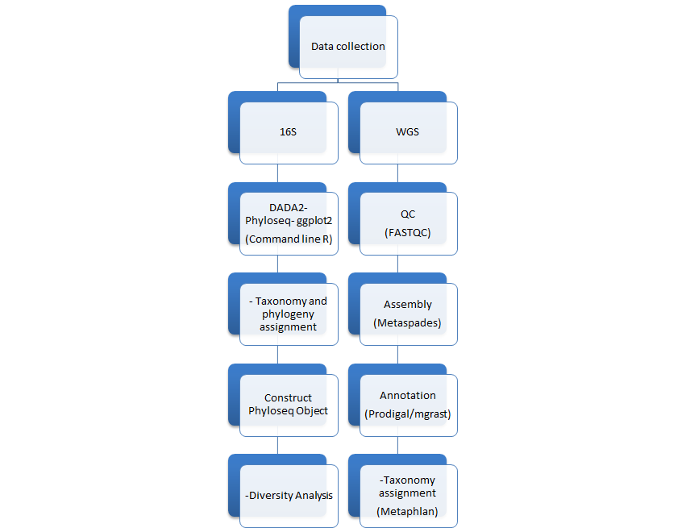

# MicrobeTaxaSARS2

### What is the problem?

### Why should we solve it?

### What is MicrobeTaxaSARS2?

### Workflow for MicrobeTaxaSARS2
Here is the workflow for the pipeline:

### How to use PubRunner
Installation options:
We will provide a docker image for installing and using SARS2MicrobeTaxa.

The Docker image will contains SARS2MicrobeTaxa and it will be downloadable from the Docker Hub.

docker pull <!-- omicscodeathon/microbetaxasars2 -->: Command to pull the image from the DockerHub
docker run <!-- omicscodeathon/microbetaxasars2 -->: Run the docker image from the command line

### Methods

In this project, we analysed Whole Genome Sequences (WGS) and 16S rRNA sequences from 5 CoVID-19 patients and the dataset used was obtained from the Sequence Read Achived. These were fecal samples from CoVID-19 patients. We used 5 control datasets to compare with the cases.

### Results

### Team

### References
